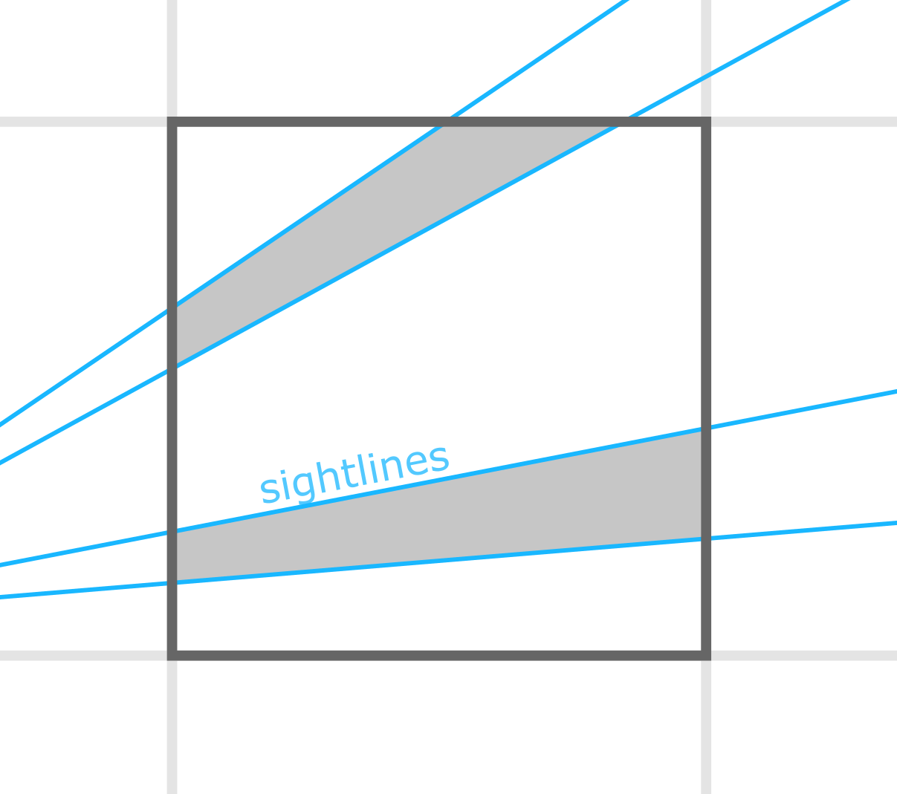
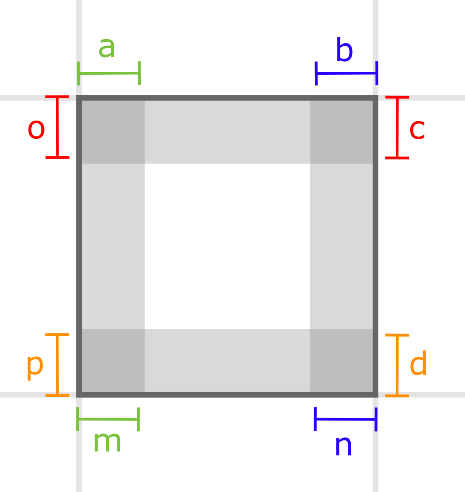
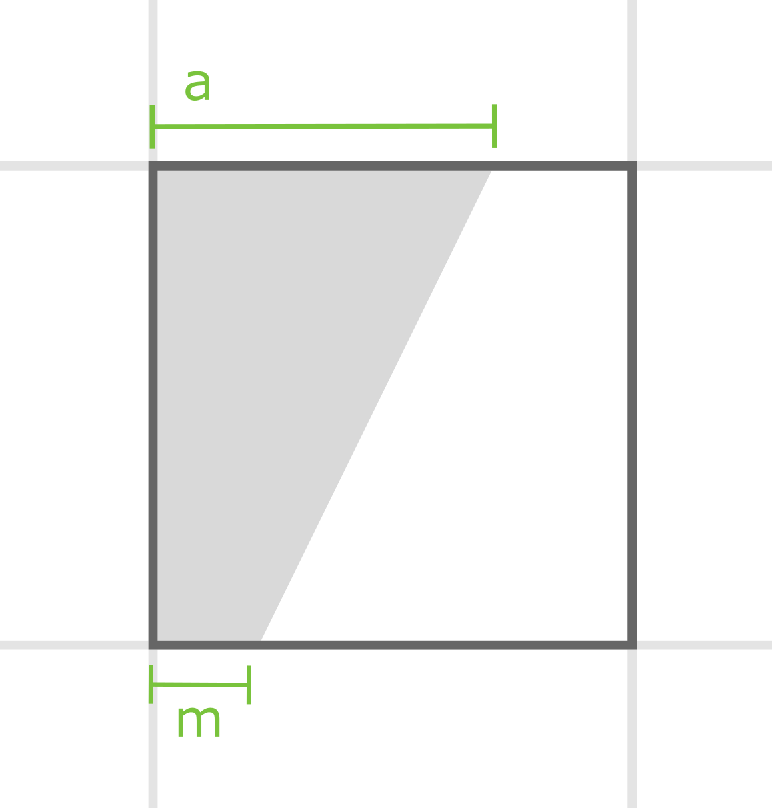
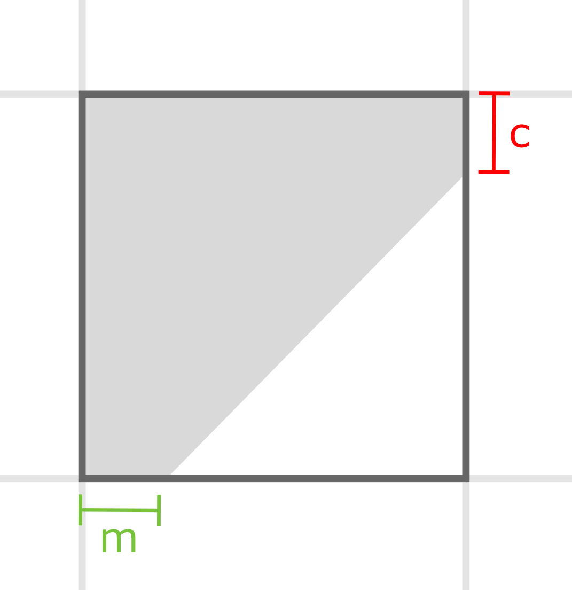
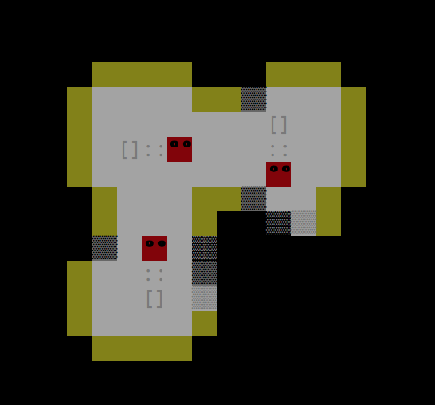

# "Non-Euclidean" Field-of-view prototype

This code is a prototype 2D FOV algorithm that runs in *O(n)* time.

Most of the source code is demo boilerplate; the interesting stuff starts on [line 215](https://github.com/pinkavat/nonEuclidFOV/blob/cc47cebaff0b306823cf76d4fb11997f4350f9f0/nonEuclidFOV.c#L215), with an algorithm that might be properly termed *shadowmarching*.

#### Shadowmarching

Shadowmarching is designed to be used on a discrete 2D grid (such as the game-world of a classic roguelike) with the following constraints:

- There is one source from which the FOV is emitted
- Every sight-blocking entity is one grid square or larger

Using these constraints we can make the following useful observations:

- The visibility of a tile in the grid depends on whether it is in shadows cast by tiles closer to the source of sight
- These shadows can only get larger as the sightlines extend further from the source
- Since everything casting a shadow is one grid square or larger, **no tile can contain both the top and bottom edges of a shadow**.

The last observation is the key. Consider this grid square:

Note that the shadows here could only have been cast by an object smaller than a grid square; therefore this circumstance is not possible given our assumptions.

Grid squares *can* contain the top edge of one shadow and the bottom edge of another; however, given our assumptions, any given tile can only contain four such edges.

The algorithm describes these "edges of shadows" in terms of how far they intrude into the grid square, thus:


Shadowmarching iterates over every grid square, quadrant by quadrant, from the source of sight outwards. Each square, therefore, has up to four incoming shadow edges *(m, n, o, and p in the above diagram)* which it gets from the two adjacent squares' outgoing shadow edges *(a, b, c, and d in the above diagram)*.

All that each grid square has to do, then, is compute the position of the output edge from the input edge. Since the shadows have a single source, the input edge position, the position of the source, and the output edge position all lie on the same line, so this is trivial to compute.


There's just one small wrinkle: if the line of the shadow's edge is tilted at a sufficiently extreme angle, the output point lies on a different edge of the grid square than the one directly opposite the input point. Fortunately, all we have to do is check for this and adjust the different edge's output accordingly:


All that remains is to compute what percentage of the grid square is overshadowed (just calculating the area of the polygons described by the edge lines and the bounds of the grid cell). If the grid cell is entirely in shadow, it is not visible; otherwise it is.

A continuous implementation (i.e. one that doesn't render to ASCII graphics) could even show the shadow-lines themselves; this demo implementation just converts the shadow coverage into a shading of the entire affected cell.

Since each grid cell within sight-range is touched exactly once, and its computations depend only on the data of the two adjacent cells, shadowmarching runs in linear time.

#### The "Non-Euclidean" part

The *really* interesting application of shadowmarching is this: the next grid square in the iteration is not necessarily the adjacent grid square in space.

If the shadowmarcher is given arbitrary adjacency data for the grid squares, it can render distant areas of the grid as if they are close by.
The sightline "leaps" through a "portal" (so to speak).

The demo code here has a grid-world that consists of a single L-shaped "room" with two of these "portals" on two of its edges. From the shadowmarcher's point of view, the grid squares adjacent to these portals lie next to each other in space, when in fact, the square in question is on the other side of the room. The result is a sort of mirror-maze effct, where the little red avatar can see themselves leaving the "next room" as they step into it.



*There is only one little red avatar, and only one room.*


## Installation

Requires NCURSES.
Compile with any C compiler; something like:
```
cc -lncurses nonEuclidFOV.c
```

## Usage

Run the resulting executable.

The avatar is the red tile; move with the **arrow keys**. **Ctrl-C** to exit.

To change demo worlds, edit the code. Uncomment lines 67-91, comment out lines 93-121, change lines 20 and 21 to reflect the world's new dimensions, and recompile.

The demo world currently uncommented (demo world #2) is a single L-shaped room with portals in two corners, demonstrating rotation in the rendered tiles. Demo word #1 is an "impossible corridor" that is longer on one side than the other.
